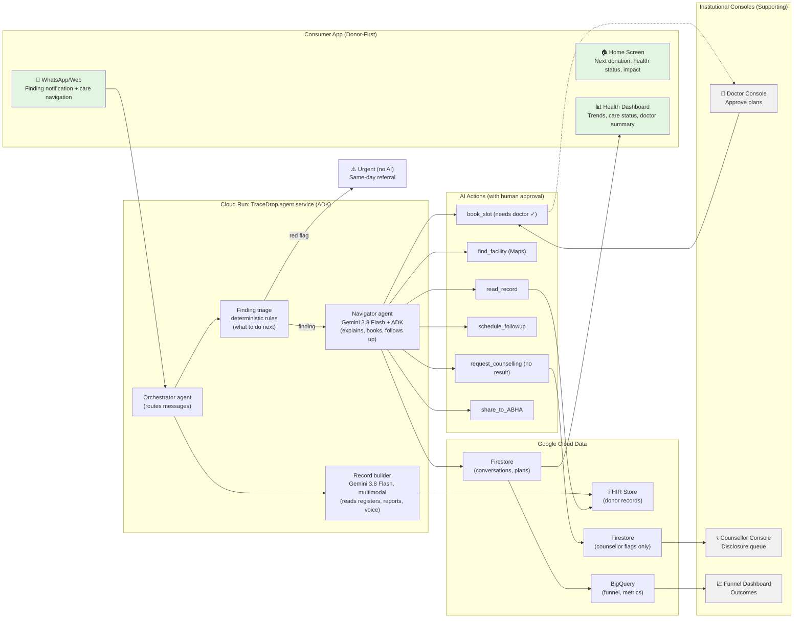

# TraceDrop architecture

## Design principles

1. **The consumer is the center, not the margin.** Every component is designed for the donor's experience first. The app shows health visibility and care navigation. Institutional consoles are secondary surfaces. Donors own and control their data.

2. **Gen AI does the navigator's work. Ordinary code does the safety work.** Thresholds, eligibility, red flags and scheduling are deterministic. Gemini reads, reasons, explains and acts, inside those rails. The AI makes the donor experience delightful; safety and privacy are hard rules.

3. **Humans approve at defined points.** The doctor approves before `book_slot`, using ADK tool confirmation. The counsellor owns every disclosure. Red flags bypass the AI entirely. Humans stay visible to the donor (not hidden background processes).

4. **No integration needed to start.** Records can come from any register photo, PDF or image and are written as FHIR. That makes them ready for ABHA later. Donors can upload their own reports.

5. **No infection result ever reaches a model prompt that writes to the donor.** Reactive flags live in a separate, counsellor-only collection. The navigator only knows "counselling required: yes/no". Privacy by design, not afterthought.

## System diagram

### From the donor's perspective (consumer platform):

```
┌──────────────────────────────────────────────────────────────────┐
│                        DONOR'S JOURNEY                           │
├──────────────────────────────────────────────────────────────────┤
│                                                                  │
│  1. DONATION → Measurement (BP/Hb)                             │
│       ↓                                                          │
│  2. FINDING → WhatsApp in my language, with my trend            │
│       ↓                                                          │
│  3. UNDERSTANDING → "Why it matters" + next step               │
│       ↓                                                          │
│  4. CARE BOOKED → Saturday 10am, free, nearby                  │
│       ↓                                                          │
│  5. APP HOME → Trend visible, impact badge                     │
│       ↓                                                          │
│  6. CARE COMPLETED → "You caught this in time"                 │
│       ↓                                                          │
│  7. RETURN TO DONATION → Every 3 months (habit)                │
│                                                                  │
└──────────────────────────────────────────────────────────────────┘
```

### Technical architecture:



## Components

| Component | Responsibility | Google tech | Consumer-First Notes |
|---|---|---|---|
| **Channel adapter** | Receives and sends WhatsApp and web messages; handles images and audio | Cloud Run endpoint; WhatsApp Cloud API webhook | **Donor experience first:** Response time <5 sec. Fallback to web is transparent. Voice is optional but impressive. |
| **Orchestrator agent** | Routes each message: a new record, a question, or the reply to a follow-up | ADK `LlmAgent` with sub-agents | The session holds donor ID, language and the active plan. Remembers donor across sessions. |
| **Record builder** | Turns an image or PDF into structured readings: value, unit, reference range, date, lab and a confidence for each field | Gemini 3.8 Flash, structured output (JSON schema) | **Donor uploads their own reports** (or blood centre photos). Normalises units. Questions fields below 0.8 confidence. Writes FHIR Observations and a DiagnosticReport. |
| **Finding triage** | Applies the [protocol rules](protocol-rules.md) and outputs finding type, urgency and protocol ID | Python (pure functions, unit-tested) | Red flags short-circuit to fixed templates, with no Gemini call. No diagnostic language reaches the donor. |
| **Navigator agent** | Explains in the donor's language using their trend and history; drafts the plan and the doctor's summary; acts through tools; follows up | ADK `LlmAgent` on Gemini 3.8 Flash; Gemini 3.8 Live as a stretch goal | **Donor is the conversational partner.** Explains "why it matters to YOU" using their own trend, family history, and language. Every message sounds like a friend, not a doctor. |
| **`book_slot`** | Books the AAM, eSanjeevani or centre recheck slot | ADK `FunctionTool(book_slot, require_confirmation=needs_doctor)` | **Donor sees booking confirmed same-day.** Confirmation is answered from the doctor console through the ADK API's `adk_request_confirmation`. Donor gets a calendar entry. |
| **`find_facility`** | Finds the nearest AAM or Namma Clinic, eSanjeevani, or NVHCP treatment centre | Maps Places API (real locations) plus a mock slot schedule | **Donor sees distance and travel time.** Real facility types and locations, mock availability. Shows "2km from your home, 15 min by auto". |
| **`request_counselling`** | Books "a confidential conversation about your donation" without revealing the result | Firestore (counsellor queue) | **Donor never sees what the counsellor will discuss.** The navigator never sees the reason, only a flag. Counsellor handles sensitive conversation. |
| **Donor App Home Screen** | Shows next donation date, current health status, trends, impact badge, care status | Firebase Hosting | **This is the hero surface for donors.** Everything is visible, owned, and actionable. Not a dashboard—a personal health mirror. |
| **Doctor console** | Plan cards with evidence and the protocol cited; approve, edit or reject; batch approval | Firebase Hosting with Firebase Auth | Each decision is logged with the doctor's ID. Doctor sees what the donor will see. |
| **Counsellor console** | Disclosure queue, agent contact status, "mark done" | Firebase Hosting with Auth (separate role) | Only role with access to the flags. Shows agent's progress per donor. |
| **FHIR store** | Donor records: Patient, Observation (BP, Hb, HbA1c, …), DiagnosticReport | Cloud Healthcare API (FHIR R4) | **Donor owns their FHIR record.** Uses ABDM-style resource shapes so ABHA works later. Donor controls what's shared. |
| **Funnel and evaluation** | Event stream: finding → explained → approved → booked → completed → cleared → donated again | Firestore → BigQuery (scheduled export or streaming) | **Donor-centric metrics:** Day-1 app return rate, care pathway completion, donor retention at 6 months, health behavior change. |

## Models

The model IDs come from the Gemini API models page, checked 8 Oct 2026 ([ai.google.dev](https://ai.google.dev/gemini-api/docs/models)).

| Job | Model | Why |
|---|---|---|
| Record extraction (images and PDFs) | `gemini-3.8-flash` | Multimodal, structured output, fast |
| Navigator reasoning and explanations | `gemini-3.8-flash` | Long context (protocols plus the donor's history), Indian languages |
| Voice (stretch) | `gemini-3.8-live` | Live API, native audio |
| LLM judge in the evaluation | `gemini-3.8-flash` (separate prompt) | Checks for diagnosis language and leaks |
| Cheap classification (route intents) | `gemini-3.5-flash-lite` | Cost and latency |

**Check on day 1:** test the quality of Hindi and Kannada text and voice. Per-language Live support is **unverified**.

## The `book_slot` approval

This uses the ADK tool confirmation API. It's experimental and needs Python ADK v1.14.0 or later ([ADK docs](https://adk.dev/tools-custom/confirmation/)).

```python
from google.adk.agents import LlmAgent
from google.adk.tools import FunctionTool, ToolContext

async def needs_doctor(facility_type: str, reason_code: str, tool_context: ToolContext) -> bool:
    # Every plan that changes care needs the doctor. Only reminders for an existing approved plan skip it.
    return reason_code != "reminder_existing_plan"

def book_slot(donor_id: str, facility_type: str, facility_id: str, slot_iso: str, reason_code: str) -> dict:
    """Book a next-step slot (AAM BP/sugar check, eSanjeevani consult, centre Hb recheck)."""
    ...  # write booking to Firestore; emit funnel event "booked"
    return {"status": "booked", "slot": slot_iso}

navigator = LlmAgent(
    name="navigator",
    model="gemini-3.8-flash",
    instruction=NAVIGATOR_PROMPT,  # protocol text, the "never" list, tone, language
    tools=[read_record, find_facility,
           FunctionTool(book_slot, require_confirmation=needs_doctor),
           schedule_followup, request_counselling, share_summary],
)
```

The doctor console answers the pending `adk_request_confirmation` call through the agent API (`/run_sse`) with `{"confirmed": true}`. The ADK docs give the response format.

**Limitation to plan for:** confirmation isn't supported with `DatabaseSessionService` or `VertexAiSessionService`. So:
- the demo uses the in-memory session service, with one Cloud Run instance (`--min-instances=1`) for the session;
- plans and audit records are kept in Firestore, so a restart only loses the open conversation;
- the alternative is to model approval as plan state in Firestore. The tool reads `plan.status == "approved"` and returns "pending approval" otherwise. Use this if the experimental API misbehaves.

## Data model (Firestore and FHIR)

| Collection / resource | Key fields |
|---|---|
| FHIR `Patient` | synthetic ID, age, sex, language, city (no real identifiers) |
| FHIR `Observation` | code (LOINC: 8480-6 systolic, 8462-4 diastolic, 718-7 Hb, 4548-4 HbA1c), value, unit, effective date, source (register/report), confidence |
| FHIR `DiagnosticReport` | lab name, date, extracted results, original image reference |
| `findings` | donor ID, type (BP_STAGE1, HB_LOW_MILD, …), urgency, protocol ID, created at |
| `plans` | finding ID, steps, drafted summary, status (draft/pending/approved/rejected), doctor ID, decided at |
| `bookings` | plan ID, facility, slot, status (booked/completed/missed) |
| `messages` | donor ID, direction, language, text, tool calls, timestamp |
| `counsellor_flags` (restricted) | donor ID, reason (synthetic), status (to contact/reached/booked/done) |
| `audit` | actor (agent/doctor/counsellor), action, object, timestamp |

## Security and privacy in the prototype

- Synthetic data only. The team's own real reports are kept in a separate bucket and deleted after the evaluation.
- Firebase Auth roles: `doctor` and `counsellor`. Firestore security rules mean `counsellor_flags` is readable only by the counsellor role.
- The navigator's prompts never include `counsellor_flags` fields, and a unit test asserts this.
- All Gemini calls go through one wrapper that logs the prompt hash and the model ID for audit.

## Deployment

```bash
# Agent service (ADK) on Cloud Run
export GOOGLE_CLOUD_PROJECT=<project> GOOGLE_CLOUD_LOCATION=asia-south1 GOOGLE_GENAI_USE_ENTERPRISE=True
adk deploy cloud_run --project=$GOOGLE_CLOUD_PROJECT --region=$GOOGLE_CLOUD_LOCATION \
  --service_name=tracedrop-agent --app_name=tracedrop ./agent -- --min-instances=1

# Consoles and donor web chat
firebase deploy --only hosting,firestore:rules
```

The deploy command comes from the [ADK Cloud Run docs](https://adk.dev/deploy/cloud-run). Store the API key in Secret Manager, as those docs describe. Check that the Healthcare API FHIR store and Maps Places are available in the chosen region.

## Repository layout (public GitHub repo)

```
tracedrop/
├── agent/                 # ADK app: __init__.py, agent.py (root_agent), tools/, prompts/
├── rules/                 # protocol rules (pure Python) + tests
├── data/                  # synthetic generator, sample registers/reports
├── web/                   # Firebase: donor chat, doctor console, counsellor console, funnel
├── eval/                  # extraction, leak, language and rule tests; results.json
├── docs/                  # architecture diagram, deck PDF, screenshots
└── README.md              # setup, deploy, demo link, data notice ("synthetic only")
```
